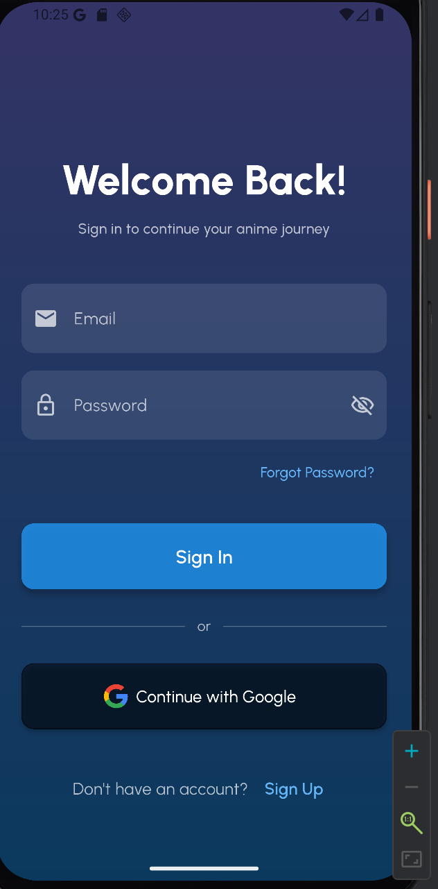
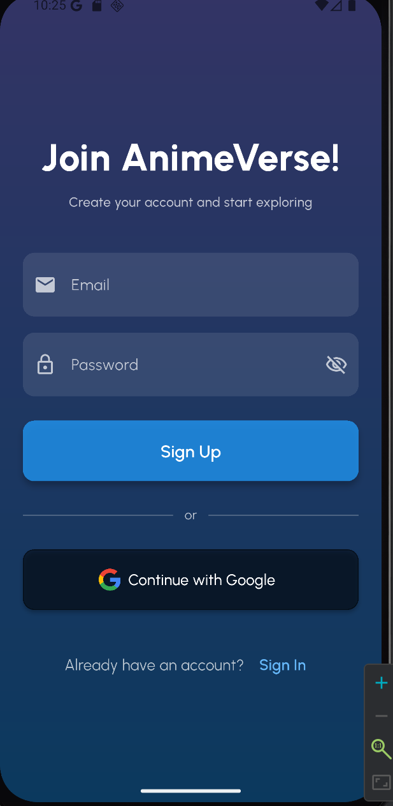
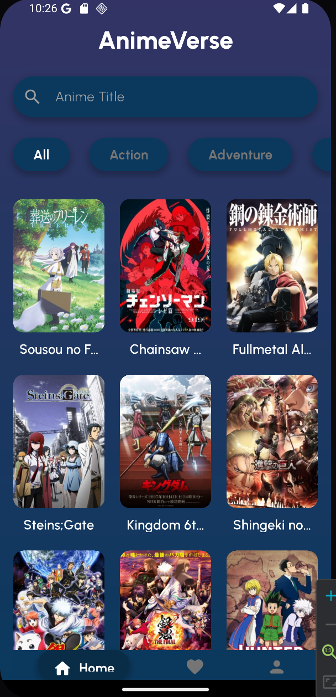
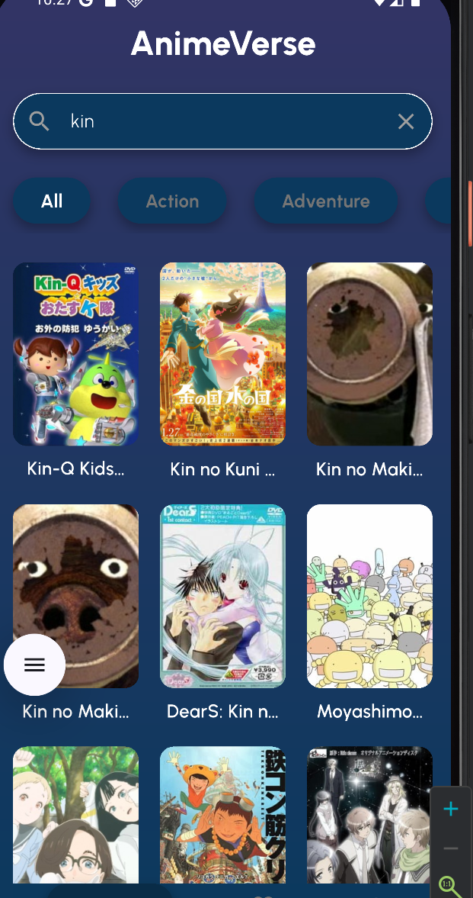
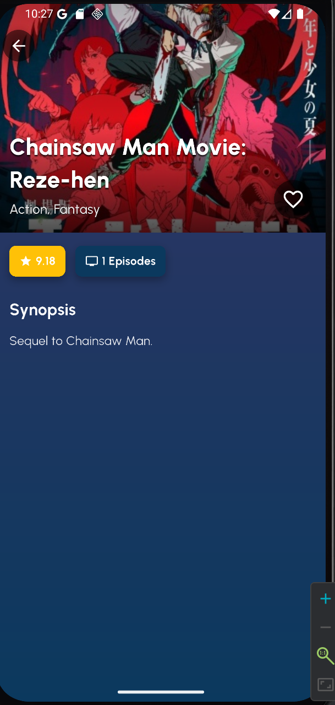
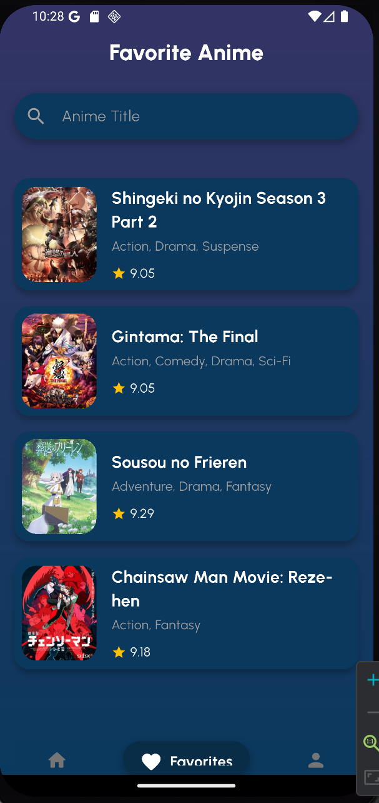
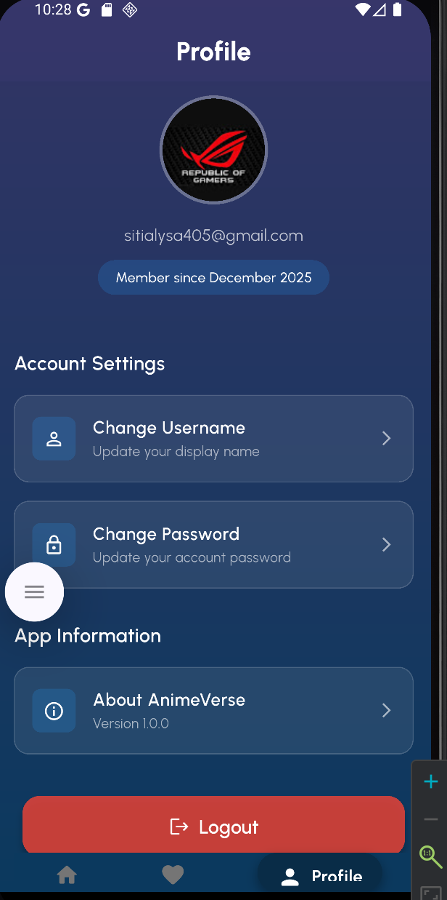

# 🌌 AnimeVerse


**AnimeVerse** adalah aplikasi mobile modern berbasis Flutter yang dirancang untuk penggemar anime. Aplikasi ini memungkinkan pengguna menjelajahi database anime yang luas, mencari judul favorit, melihat detail mendalam, serta menyimpan koleksi pribadi ke cloud secara real-time.

Dibangun dengan prinsip **Clean Architecture**, aplikasi ini menggunakan **Provider** untuk manajemen state, **GoRouter** untuk navigasi yang efisien, dan terintegrasi penuh dengan ekosistem **Firebase**.

---

## 👤 Identitas Pengembang

| Atribut | Detail |
| :--- | :--- |
| **Nama** | Muhammad Aryasatya |
| **NIM** | 231401094 |
| **Lab** | 2 |

---

## 📸 Dokumentasi Aplikasi (Screenshots)

Berikut adalah tampilan antarmuka aplikasi AnimeVerse.

### 🔐 Autentikasi
| Sign In | Sign Up |
|:---:|:---:|
|  |  |
| *Login dengan Email/Google* | *Registrasi Akun Baru* |

### 🎬 Fitur Utama
| Home (Dashboard) | Pencarian & Filter | Detail Anime |
|:---:|:---:|:---:|
|  |  |  |
| *Top Anime & Kategori* | *Cari Anime & Genre* | *Info Lengkap & Sinopsis* |

### 👤 User & Favorit
| List Favorit | Profil User |
|:---:|:---:|
|  |  |
| *Koleksi Pribadi (Cloud)* | *Pengaturan Akun* |

---

## ✨ Fitur Utama

### 🔐 Autentikasi & Pengguna
* **Login & Register:** Autentikasi aman menggunakan Email & Password via Firebase Auth.
* **Google Sign-In:** Login cepat satu ketukan menggunakan akun Google.
* **Manajemen Profil:** Pengguna dapat mengubah password, melihat informasi akun, dan logout dengan aman.

### 🎬 Eksplorasi Anime
* **Top Anime:** Menampilkan daftar anime terpopuler saat ini (menggunakan [Jikan API v4](https://jikan.moe/)).
* **Pencarian Pintar:** Cari anime berdasarkan judul dengan fitur *debounce* untuk efisiensi API.
* **Filter Genre:** Temukan anime berdasarkan kategori (Action, Adventure, Fantasy, dll).
* **Detail Lengkap:** Sinopsis, rating, jumlah episode, status tayang, dan trailer gambar.

### ❤️ Favorit (Cloud Sync)
* **Simpan ke Favorit:** Menandai anime yang disukai.
* **Sinkronisasi Real-time:** Data favorit disimpan di **Cloud Firestore**, sehingga tetap tersinkronisasi meskipun berganti perangkat.

### 🎨 UI/UX Modern
* **Responsive Grid:** Tampilan kartu anime yang menyesuaikan ukuran layar (ponsel & tablet).
* **Glassmorphism:** Desain antarmuka transparan dan elegan dengan tema gelap.
* **Optimasi Gambar:** Menggunakan *caching* gambar untuk menghemat kuota dan mempercepat loading.

---

## 🛠️ Teknologi yang Digunakan

| Kategori | Teknologi / Library | Deskripsi |
| :--- | :--- | :--- |
| **Framework** | Flutter & Dart | SDK utama pengembangan aplikasi |
| **State Management** | Provider | Mengelola state aplikasi (AppState & Auth) |
| **Navigation** | GoRouter | Routing, deep linking, dan manajemen stack navigasi |
| **Backend** | Firebase Auth | Menangani registrasi dan login user |
| **Database** | Cloud Firestore | NoSQL Database untuk menyimpan data favorit user |
| **Data Source** | Jikan API (V4) | API publik unofficial MyAnimeList |
| **Network** | HTTP Package | Melakukan request REST API |
| **UI Components** | Cached Network Image | Menampilkan gambar dengan cache manager |

---

## 📂 Struktur Project

Berikut adalah pemetaan struktur direktori source code `lib/`:

```text
lib/
├── config/
│   └── routes.dart             # Konfigurasi GoRouter dan Guard navigasi
├── models/
│   └── anime.dart              # Data Model untuk objek Anime (JSON Serialization)
├── providers/
│   ├── app_state_provider.dart # Logic utama data anime & interaksi UI
│   └── auth_provider.dart      # Logic autentikasi & bridge ke UI
├── repositories/
│   └── anime_repository.dart   # Layer komunikasi ke Jikan API
├── screens/
│   ├── detail_screen.dart      # Halaman detail anime
│   ├── favorite_screen.dart    # Halaman list favorit user
│   ├── home_screen.dart        # Dashboard utama
│   ├── profile_screen.dart     # Halaman profil & settings
│   ├── signin_screen.dart      # Halaman login
│   └── signup_screen.dart      # Halaman registrasi
├── services/
│   ├── auth/                   # Service layer untuk Firebase Auth
│   └── firestore_service.dart  # Service layer untuk Cloud Firestore
├── utils/
│   ├── snackbar_helper.dart    # Helper global untuk notifikasi
│   └── validators.dart         # Validasi input form (Regex Email, Password)
├── widgets/
│   ├── anime_card.dart         # Widget kartu anime grid
│   ├── anime_view.dart         # Layout grid responsif
│   ├── app_scaffold.dart       # Wrapper dasar halaman dengan background
│   ├── bottom_navigation_shell.dart # Navigasi bar bawah (Persistent)
│   ├── favorite_anime_card.dart # Widget kartu list favorit
│   ├── genre_list.dart         # Horizontal list filter genre
│   ├── gradient_background.dart # Background gradien aplikasi
│   └── profile_button.dart     # Tombol menu profil
└── main.dart                   # Entry point & inisialisasi App

## 🚀 Cara Menjalankan Aplikasi (Installation Guide)

Ikuti langkah-langkah berikut untuk menjalankan aplikasi di komputer lokal Anda.

### 1. Prasyarat Sistem
Pastikan Anda telah menginstal:
* **Flutter SDK:** Versi 3.0 atau lebih baru.
* **Java (JDK):** Versi 11 atau 17.
* **IDE:** Android Studio atau VS Code (dengan ekstensi Flutter & Dart).
* **Emulator Android** atau **Perangkat Fisik** (Aktifkan USB Debugging).

### 2. Clone Repository & Install Dependencies
```bash
# Clone repository ini
git clone [https://github.com/aryasatya2204/anime-verse.git](https://github.com/aryasatya2204/anime-verse.git)

# Masuk ke folder project
cd anime-verse

# Install library/dependencies yang dibutuhkan
flutter pub get

## ⚙️ Konfigurasi Firebase & Build APK

Panduan langkah demi langkah untuk menghubungkan project dengan Firebase, mengatur tanda tangan digital (Signing), dan membangun file APK siap rilis.

### 1. Setup Firebase Project (Wajib)
Project ini membutuhkan koneksi ke Firebase agar fitur Login dan Database berfungsi.

1. Buka [Firebase Console](https://console.firebase.google.com/).
2. Buat project baru (misal: **AnimeVerse**).
3. Tambahkan aplikasi **Android** dengan detail berikut:
   * **Package Name:** `com.example.project_lab`
     *(Pastikan sesuai dengan `applicationId` di `android/app/build.gradle.kts`)*.
   * **App Nickname:** AnimeVerse (Opsional).
4. Download file **`google-services.json`**.
5. Pindahkan file tersebut ke direktori project Anda:
   `android/app/google-services.json`

### 2. Aktifkan Fitur Firebase
Di dashboard Firebase Console, aktifkan layanan berikut:

* **Authentication:**
  * Masuk ke menu *Build > Authentication > Sign-in method*.
  * Aktifkan **Email/Password**.
  * Aktifkan **Google**.
* **Cloud Firestore:**
  * Masuk ke menu *Build > Firestore Database*.
  * Klik **Create Database**.
  * Pilih lokasi server (disarankan: *Singapore* atau *Jakarta* jika ada).
  * Pilih **Start in Test Mode** (untuk pengembangan awal).

### 3. Konfigurasi Keystore (Signing Key)
Untuk keamanan dan rilis, project ini tidak menyimpan password keystore di dalam kode, melainkan menggunakan file properti terpisah.

1. Buat file baru bernama `key.properties` di dalam folder `android/`.
2. Salin konfigurasi berikut ke dalamnya:

```properties
storePassword=passwordKeystoreAnda
keyPassword=passwordKeyAnda
keyAlias=upload
storeFile=../app/upload-keystore.jks

3. Jika Anda belum memiliki file keystore (`.jks`), buat baru dengan menjalankan perintah ini di terminal:
   *(Pastikan password yang Anda masukkan sesuai dengan yang ditulis di `key.properties`)*

```bash
keytool -genkey -v -keystore android/app/upload-keystore.jks -keyalg RSA -keysize 2048 -validity 10000 -alias upload

### 4. Registrasi SHA-1 (Penting untuk Google Login)
Agar Google Sign-In berfungsi (menghindari error `DEVELOPER_ERROR` atau `Code 10`), Anda harus mendaftarkan sidik jari sertifikat aplikasi ke Firebase.

1. Jalankan perintah berikut di terminal untuk melihat kode SHA-1:

   ```bash
   cd android
   ./gradlew signingReport
   
1. (Tunggu hingga proses selesai. Akan muncul daftar kunci untuk variant `debug` dan `release`).
2. Salin kode **SHA1** dari bagian **Variant: release** (dan `debug` jika perlu).
3. Buka **Firebase Console** > **Project Settings** > **General**.
4. Scroll ke bawah ke bagian **Your Apps**, klik **Add fingerprint**.
5. Tempel kode SHA-1 tadi dan simpan.

> **PENTING:** Jika file `google-services.json` berubah, download ulang dan timpa file yang lama di folder `android/app/`.

## 5. Membangun APK (Build Release)

Setelah semua konfigurasi selesai, Anda dapat membuat file APK yang siap diinstal atau diupload ke Play Store.

Kembali ke root folder project (jika masih di folder `android`):

```bash
cd ..

Jalankan perintah build:

```bash
flutter build apk --release

Tunggu proses selesai. File APK Anda akan berada di:  
📂 `build/app/outputs/flutter-apk/app-release.apk`

## 📦 Cara Menginstal APK ke HP

1. Pindahkan file `app-release.apk` ke HP Anda (via USB/WhatsApp/Drive).
2. Buka file tersebut di HP.
3. Jika diminta, izinkan **instalasi dari sumber tidak dikenal** (Unknown Sources).
4. Klik **Install**.